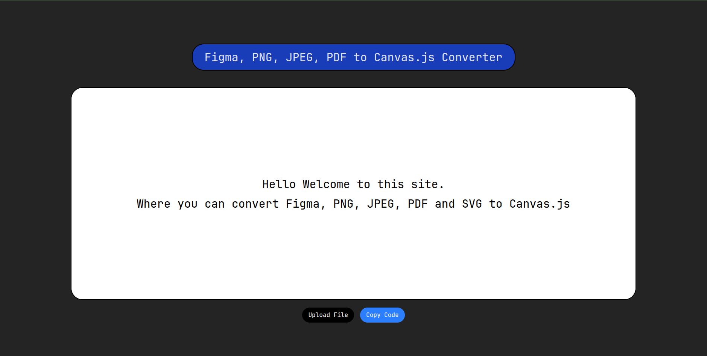
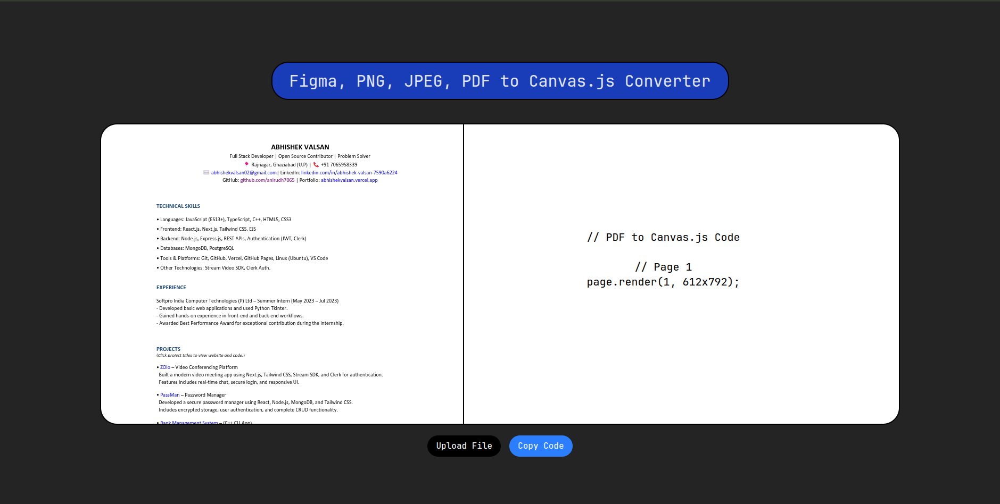

# 🎨 Figma-to-Canvas

Convert your **Figma (or any design) files** directly into a rendered **HTML Canvas** with clean, reusable code.  
This project is built with **React + TypeScript + Vite** and is developer-focused yet easy to use.



---

## ✨ Features

- 📂 Upload any supported design/image/PDF file  
- 🖼️ Render directly on HTML `<canvas>`  
- 🔄 Get **generated Canvas API code** from the design  
- ⚡ Built with **React + TypeScript** (Vite for fast builds)  
- 💡 Easy to customize and extend

---
## 🛠️ Tech Stack
<p align="center">
  
  
  
  
</p>


## 🚀 Getting Started

### 1️⃣ Clone the repo

```bash
git clone https://github.com/anirudh7065/Figma-to-Canvas.git
cd Figma-to-Canvas
````

### 2️⃣ Install dependencies

```bash
npm install
```

### 3️⃣ Run the development server

```bash
npm run dev
```

> The app will start at `http://localhost:5173`

---

## 🖼️ How It Works

1. **Upload File** – Choose an image, Figma export, or PDF.
2. **Process** – The app extracts the image data and draws it on `<canvas>`.
3. **Generate Code** – Outputs equivalent Canvas API drawing code that you can copy into your own projects.




---

## 📁 Project Structure

```
├── README.md
├── public/               # Static assets
├── src/
│   ├── App.tsx           # Main React component
│   ├── lib/fileUpload.ts # Core file processing & canvas logic
│   ├── assets/           # Icons and images
│   └── index.css         # Styles
├── package.json
├── vite.config.ts
└── tsconfig.json
```

---

## 📷 Screenshots

* `./public/ss2.png` – Main app view

- `./public/ss1.png` – Rendered canvas


---

> Built with ❤️ using **React + TypeScript + Canvas API**


